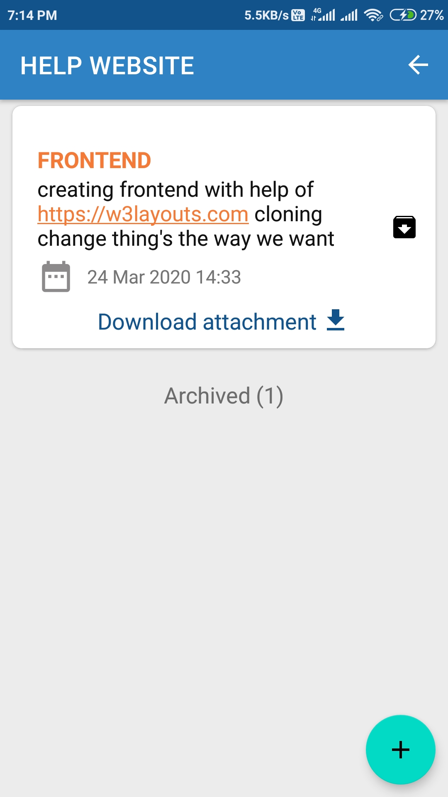

## Task

Free your brain from remembering every planning detail.

## Sign In/Sign Up with different methods
###  Email & Google
  
 
  
Using Email and password users can log in and registration, when the user registered, User will get a confirmation mail and forgot password with this user,User can update new password.

Using Google Sign in/Sign up using Google account automatically we will fetch user data like name, email, and user profile photo.

## Add plan
First, add board title(3~50) under board add with list add cards.

Add plans to list which have Title(50), with auto-reminder and attachment which helps to a better understanding about the plan, a short description (500), Team types Personal and Team, and archive action (temporary).

 
 
 
